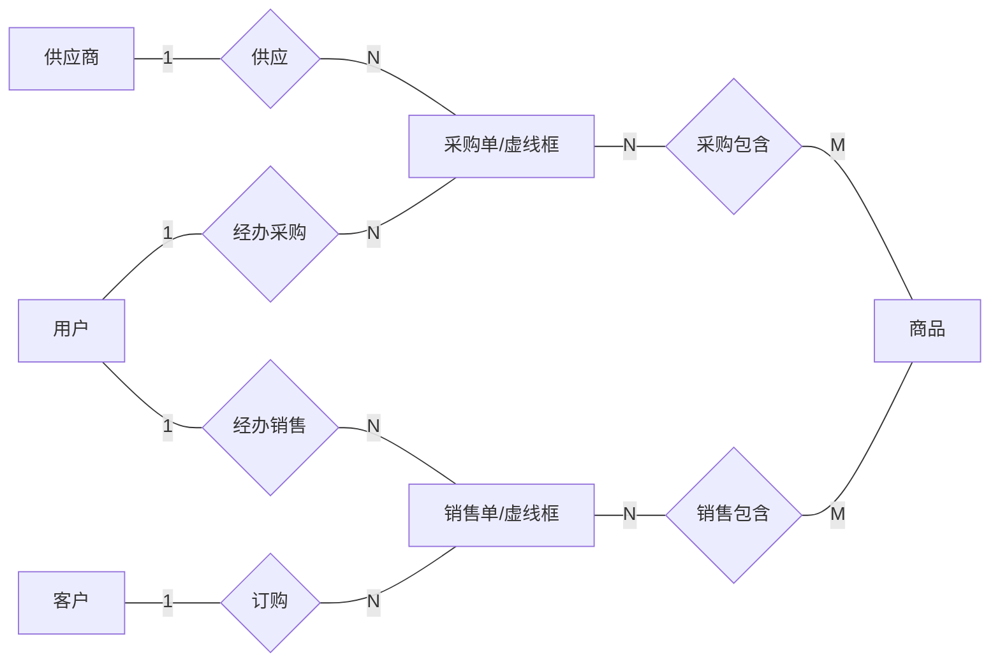
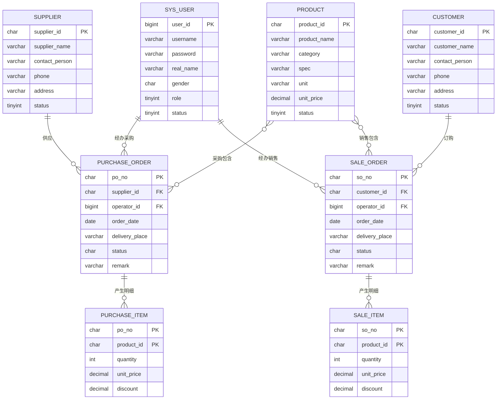

# 商品进销存管理系统 —— ER 模型设计文档

> 文档定位：本文是系统的**概念模型设计说明书**，同时是一份 ER 图绘制操作手册。按本文第 8 章的步骤操作、用第 9 章的核对表自检，即可无歧义地画出正确的 ER 图。
> 配套文档：字段类型、约束、视图 SQL 见《02-数据库设计.md》；建表脚本见 `sql/init.sql`。

---

## 1. 系统概述

商品进销存管理系统面向小型商贸企业，管理**客户、供应商、商品**三类基础档案，处理**采购入库**与**销售出库**两类业务单据，并实时查询商品库存。

业务边界（本系统包含什么）：

- 基础档案管理：用户、客户、供应商、商品；
- 采购业务：采购单（一次向一个供应商采购多种商品）；
- 销售业务：销售单（一次向一个客户销售多种商品）；
- 单据审核与库存查询。

不在本系统范围内：收付款、退货、仓库/库位管理、会员积分、两级以上的多角色权限（本系统仅设店长/店员两级）。

---

## 2. 设计原则（画 ER 图前必须遵守）

| 原则 | 说明 | 本系统的落实 |
|---|---|---|
| 基本项才入库 | 数据库只保存"必须保存、往往需要人工输入"的数据 | 编号、名称、日期、数量、单价等 |
| 组合项必须拆分 | 一个属性不能包含多个独立含义 | 不设"客户信息"等混合字段；性别单列 |
| 导出项不入库 | 能由基本项计算得到的值不存储 | **金额 = 单价 × 数量 × 折扣**，不设金额字段；**库存**用视图实时计算；不设年龄、小计、合计字段 |
| 外键不画进概念 ER 图 | 概念图中实体间的关系由"联系 + 基数"表达；外键是联系**落表时**才产生的列 | 采购单实体上**不挂**"供应商编号"椭圆；它由"供应"联系落表生成 |
| 视图不画进 ER 图 | 视图是基于表的查询，属于实现层 | `v_stock` 等三个视图不出现在 ER 图中 |

---

## 3. 两层模型说明（避免"明细表画不画"的困惑）

本系统在两个层次上表达数据，画图时不要混用：

| 层次 | 图形 | 明细如何表达 | 实体/表数量 |
|---|---|---|---|
| **概念层（陈式 ER 图）** | 矩形=实体，菱形=联系，椭圆=属性 | 采购明细、销售明细**不画成矩形**，而是用采购单与商品之间**带属性的 M:N 菱形**（采购包含 / 销售包含）表达 | 6 个实体 |
| **逻辑层（关系模型/数据表）** | 表格 | M:N 菱形落为独立的**明细表**（purchase_item / sale_item） | 8 张表 |

这正是课程"联系新增有局限 → 引进虚实体（提货单）→ 提货单 + 提货明细"的演进：
业务上先有"采购交易"，为避免一次采购多种商品时重复录入供应商、日期等信息，把交易本身提升为**采购单实体（虚实体）**，每种商品一行的部分由"采购包含"联系携带数量、单价、折扣，落表后即**采购明细**。

---

## 4. 实体总览

概念 ER 图中共 **6 个实体**：

| 编号 | 实体名 | 图形样式 | 含义 | 主键 |
|---|---|---|---|---|
| E1 | 用户 | 实线矩形 | 系统操作人员（经手人） | 用户编号 |
| E2 | 客户 | 实线矩形 | 购货的往来单位 | 客户编号 |
| E3 | 供应商 | 实线矩形 | 供货的往来单位 | 供应商编号 |
| E4 | 商品 | 实线矩形 | 经营的商品档案 | 商品编号 |
| E5 | 采购单 | **虚线矩形（虚实体）** | 一次采购交易 | 采购单号 |
| E6 | 销售单 | **虚线矩形（虚实体）** | 一次销售交易 | 销售单号 |

> 关于虚线矩形：课程课件将由交易联系演进来的"提货单"画为虚线矩形，本设计沿用。若任课教师要求按弱实体规范绘制，可将 E5/E6 改为**双线矩形（弱实体）**、"采购包含/销售包含"改为**双菱形（识别联系）**，语义完全等价，其余不变。

---

## 5. 实体卡片（属性逐项定义）

> 画法约定：每个属性画一个椭圆，用直线连到所属实体矩形；**主键属性的属性名下方划一条直线（下划线）**。
> 取值域中的长度为数据库实现长度，仅供理解，概念图中不必标注。

### E1 用户（系统操作人员）

| 序号 | 属性名 | 含义 | 取值域 | 键 |
|---|---|---|---|---|
| 1 | 用户编号 | 用户的唯一标识 | 整数，系统自动生成 | **PK（下划线）** |
| 2 | 用户名 | 登录名，全系统不重复 | 最长 50 字符 | 候选键（可标注 unique） |
| 3 | 密码 | 登录密码（库存加密值） | 最长 100 字符 | |
| 4 | 真实姓名 | 人员姓名 | 最长 50 字符 | |
| 5 | 性别 | 人员性别 | 枚举：{男，女} | |
| 6 | 状态 | 账号是否可用 | 枚举：{启用，停用} | |
| 7 | 角色 | 人员在系统中的角色 | 枚举：{店长，店员} | |

共 **7 个椭圆**。注意：不设"年龄"属性（年龄可由出生日期导出，属课程点名的常见错误，本系统直接不建出生日期）。

### E2 客户

| 序号 | 属性名 | 含义 | 取值域 | 键 |
|---|---|---|---|---|
| 1 | 客户编号 | 客户唯一标识 | 形如 KH0001，系统自动生成 | **PK（下划线）** |
| 2 | 客户名称 | 单位或个人名称 | 最长 100 字符 | |
| 3 | 联系人 | 对方联系人姓名 | 最长 50 字符 | |
| 4 | 联系电话 | 对方电话 | 最长 20 字符 | |
| 5 | 地址 | 对方地址 | 最长 200 字符 | |
| 6 | 状态 | 是否正常往来 | 枚举：{启用，停用} | |

共 **6 个椭圆**。

### E3 供应商

| 序号 | 属性名 | 含义 | 取值域 | 键 |
|---|---|---|---|---|
| 1 | 供应商编号 | 供应商唯一标识 | 形如 GYS001，系统自动生成 | **PK（下划线）** |
| 2 | 供应商名称 | 单位名称 | 最长 100 字符 | |
| 3 | 联系人 | 对方联系人姓名 | 最长 50 字符 | |
| 4 | 联系电话 | 对方电话 | 最长 20 字符 | |
| 5 | 地址 | 对方地址 | 最长 200 字符 | |
| 6 | 状态 | 是否正常往来 | 枚举：{启用，停用} | |

共 **6 个椭圆**。

### E4 商品

| 序号 | 属性名 | 含义 | 取值域 | 键 |
|---|---|---|---|---|
| 1 | 商品编号 | 商品唯一标识 | 形如 SP0001，系统自动生成 | **PK（下划线）** |
| 2 | 商品名称 | 商品名称 | 最长 100 字符 | |
| 3 | 分类 | 商品分类 | 最长 30 字符（如：食品、日用品） | |
| 4 | 规格型号 | 规格/型号描述 | 最长 50 字符 | |
| 5 | 计量单位 | 计数单位 | 枚举：{件，箱，个，台，包，瓶，桶，袋，提，本} | |
| 6 | 单价 | 标准售价 | 金额，两位小数 | |
| 7 | 状态 | 是否在售 | 枚举：{启用，停用} | |

共 **7 个椭圆**。商品上不设"库存数量"属性——库存由采购、销售明细经视图实时计算（导出项不入库）。

### E5 采购单（虚实体）

| 序号 | 属性名 | 含义 | 取值域 | 键 |
|---|---|---|---|---|
| 1 | 采购单号 | 采购单唯一标识 | 形如 CG20261007001，系统自动生成 | **PK（下划线）** |
| 2 | 单据日期 | 开单日期 | 日期 | |
| 3 | 交货地点 | 交货/入库地点 | 最长 100 字符 | |
| 4 | 状态 | 审核状态 | 枚举：{未审核，已审核} | |
| 5 | 备注 | 附注说明 | 最长 200 字符 | |

共 **5 个椭圆**。**不要画"供应商编号""经手人编号"椭圆**——它们分别由"供应""经办采购"联系落表产生（见第 2 章原则）。

### E6 销售单（虚实体）

| 序号 | 属性名 | 含义 | 取值域 | 键 |
|---|---|---|---|---|
| 1 | 销售单号 | 销售单唯一标识 | 形如 XS20261007001，系统自动生成 | **PK（下划线）** |
| 2 | 单据日期 | 开单日期 | 日期 | |
| 3 | 交货地点 | 交货地点 | 最长 100 字符 | |
| 4 | 状态 | 审核状态 | 枚举：{未审核，已审核} | |
| 5 | 备注 | 附注说明 | 最长 200 字符 | |

共 **5 个椭圆**。同样不画"客户编号""经手人编号"椭圆。

---

## 6. 联系清单

共 **6 个联系（6 个菱形）**。基数标注规则：在菱形连向实体的边上，"一"侧标 **1**，"多"侧标 **N**（多对多两侧分别标 **N** 和 **M**）。

| 编号 | 菱形内文字 | 连接实体 A | A 侧标注 | 连接实体 B | B 侧标注 | 联系自带属性 | 业务解释 |
|---|---|---|---|---|---|---|---|
| R1 | 供应 | 供应商 E3 | **1** | 采购单 E5 | **N** | 无 | 一个供应商可对应多张采购单；每张采购单只向一个供应商采购 |
| R2 | 订购 | 客户 E2 | **1** | 销售单 E6 | **N** | 无 | 一个客户可持有多张销售单；每张销售单只属于一个客户 |
| R3 | 经办采购 | 用户 E1 | **1** | 采购单 E5 | **N** | 无 | 一个用户可经办多张采购单；每张采购单有一个经手人 |
| R4 | 经办销售 | 用户 E1 | **1** | 销售单 E6 | **N** | 无 | 一个用户可经办多张销售单；每张销售单有一个经手人 |
| R5 | 采购包含 | 采购单 E5 | **N** | 商品 E4 | **M** | 数量、单价、折扣 | 一张采购单含多种商品；一种商品可出现在多张采购单 |
| R6 | 销售包含 | 销售单 E6 | **N** | 商品 E4 | **M** | 数量、单价、折扣 | 一张销售单含多种商品；一种商品可出现在多张销售单 |

**R5/R6 联系属性的取值域（椭圆挂在菱形上，不是挂在矩形上）：**

| 属性 | 含义 | 取值域 |
|---|---|---|
| 数量 | 该商品在本单中的数量 | 正整数 |
| 单价 | 成交单价（采购为进货价、销售为售价） | 金额，两位小数 |
| 折扣 | 成交折扣，1.00 表示不打折 | 0.00 ~ 1.00，两位小数，默认 1.00 |

R1~R4 为 1:N 联系，**没有属性**，落表时在"多"端实体表中增加外键列；
R5/R6 为 M:N 且带属性，落表时各自生成一张独立明细表。

---

## 7. 主从（虚实体）结构专述 —— 本设计的核心

### 7.1 为什么不能直接在"供应商—商品""客户—商品"之间建购买联系

假设一次采购：向 GYS001 采购 3 种商品，日期 2026-10-07，交货地点"1号仓"。若只有"购买"联系，需要写入 3 行：

| 供应商 | 商品 | 日期 | 地点 | 数量 |
|---|---|---|---|---|
| GYS001 | SP0001 | 2026-10-07 | 1号仓 | 5 |
| GYS001 | SP0002 | 2026-10-07 | 1号仓 | 6 |
| GYS001 | SP0003 | 2026-10-07 | 1号仓 | 4 |

两个问题（课程明确指出）：

- **重复录入**：供应商、日期、地点等同一批信息为每种商品重复输入；
- **数据冗余**：除商品、数量外，其他信息在表中多次重复存储，且可能因重复录入不一致。

### 7.2 解决方案：单据（虚实体）+ 包含联系

把"一次交易"提升为实体：

```
采购单（主，1 行）
  采购单号：CG20261007001
  供应商：GYS001        ← 通过"供应"联系
  单据日期：2026-10-07
  交货地点：1号仓
  经手人：admin         ← 通过"经办采购"联系
   │
   ├── 采购包含 → SP0001，数量 5
   ├── 采购包含 → SP0002，数量 6
   └── 采购包含 → SP0003，数量 4
        （采购明细，3 行；日期/地点/供应商只存一次）
```

销售业务完全同构（客户 + 销售单 + 销售包含 → 销售明细）。

### 7.3 落表结果（预告，详见数据库设计文档）

| 概念模型 | 逻辑表 |
|---|---|
| 采购单 E5 | purchase_order（主表） |
| R5 采购包含 | purchase_item（明细表，含采购单号、商品编号、数量、单价、折扣） |
| 销售单 E6 | sale_order（主表） |
| R6 销售包含 | sale_item（明细表） |

界面上表现为**一张单据表单 + 一个可增删行的明细表格**，一次保存主表与多行明细（后端用事务保证同时成功）。

---

## 8. ER 图绘制分步操作清单

### 8.1 符号规则（先记住这 5 种图形）

| 图形 | 表示 | 本图中的内容 |
|---|---|---|
| 直角矩形 | 实体 | 6 个（E5/E6 画成**虚线**矩形） |
| 菱形 | 联系 | 6 个 |
| 椭圆 | 属性 | 42 个（实体属性 36 + 联系属性 6） |
| 直线 | 实体—联系相连 | 12 条（每个菱形 2 条边） |
| 椭圆—直线—矩形/菱形 | 属性挂接 | 42 条 |
| 边上的 1 / N / M | 基数 | 12 条边上逐边标注 |
| 属性名下划线 | 主键 | 6 个实体各一处 |

### 8.2 推荐布局（照此摆放最不易连线交叉）

```
                          ┌──────────┐
                          │   用户   │
                          └──────────┘
                         1╱          ╲1
               经办采购 ╱              ╲ 经办销售
                      ╱ N            N ╲
 ┌──────────┐  1                  1  ┌──────────┐
 │ 供应商   │────── 供应 ────────────│ 采购单   │
 └──────────┘                    N  └──────────┘
                                        │ N
                                   采购包含 M
                                        │
 ┌──────────┐  1                  1  ┌──────────┐   ┌────────┐
 │ 客户     │────── 订购 ────────────│ 销售单   │M──│ 商品   │
 └──────────┘                    N  └──────────┘   └────────┘
                                        │ N
                                   销售包含 M
                                        └──────────────→商品
```

- 用户放**顶部居中**；供应商、采购单在**中部**（左、中）；客户、销售单在**下部**（左、中）；商品放**最右侧居中**。
- 属性椭圆向各实体的**外侧**展开（用户向上、供应商向左、客户向左下、商品向右、采购单向上避开菱形、销售单向下），避免与菱形连线打架。
- R5、R6 的 3 个联系属性椭圆直接挂在各自菱形旁边。

### 8.3 绘制步骤（共 7 步，按顺序做）

**步骤 1：画 6 个实体矩形并写名字。**
用户；客户；供应商；商品（实线）；采购单；销售单（**虚线边框**）。位置按 8.2 布局。

**步骤 2：画 6 个联系菱形并写名字，用直线连上实体（先不写基数）。**

1. 菱形"供应"：连 供应商、采购单；
2. 菱形"订购"：连 客户、销售单；
3. 菱形"经办采购"：连 用户、采购单；
4. 菱形"经办销售"：连 用户、销售单；
5. 菱形"采购包含"：连 采购单、商品；
6. 菱形"销售包含"：连 销售单、商品。

**步骤 3：在每条边旁标基数（逐边照抄，勿标反）。**

| 菱形 | 靠实体一侧标 | 靠单据一侧标 |
|---|---|---|
| 供应 | 供应商侧：**1** | 采购单侧：**N** |
| 订购 | 客户侧：**1** | 销售单侧：**N** |
| 经办采购 | 用户侧：**1** | 采购单侧：**N** |
| 经办销售 | 用户侧：**1** | 销售单侧：**N** |
| 采购包含 | 采购单侧：**N** | 商品侧：**M** |
| 销售包含 | 销售单侧：**N** | 商品侧：**M** |

**步骤 4：给 4 个基础实体挂属性椭圆（椭圆里写属性名）。**

- 用户挂 7 个：用户编号、用户名、密码、真实姓名、性别、角色、状态；
- 客户挂 6 个：客户编号、客户名称、联系人、联系电话、地址、状态；
- 供应商挂 6 个：供应商编号、供应商名称、联系人、联系电话、地址、状态；
- 商品挂 7 个：商品编号、商品名称、分类、规格型号、计量单位、单价、状态。

**步骤 5：给 2 个单据实体挂属性椭圆（各 5 个）。**

- 采购单挂：采购单号、单据日期、交货地点、状态、备注；
- 销售单挂：销售单号、单据日期、交货地点、状态、备注。
- 复查：这两个实体上**没有**供应商编号/客户编号/经手人编号椭圆。

**步骤 6：给 2 个 M:N 菱形挂联系属性椭圆（各 3 个）。**

- "采购包含"挂：数量、单价、折扣；
- "销售包含"挂：数量、单价、折扣。
- 复查：这些椭圆的直线连到**菱形**，不是连到商品或单据矩形。

**步骤 7：给 6 个主键属性名下划下划线。**
用户编号、客户编号、供应商编号、商品编号、采购单号、销售单号。其余属性不加下划线。

### 8.4 图形元素总数（画完后数字必须对上）

| 元素 | 应有数量 |
|---|---|
| 实体矩形（其中虚线 2 个） | 6 |
| 联系菱形 | 6 |
| 实体—联系连线（带基数标注） | 12 |
| 实体属性椭圆（7+6+6+7+5+5） | 36 |
| 联系属性椭圆（3+3） | 6 |
| 椭圆合计 | 42 |
| 主键下划线 | 6 |

---

## 9. 画完自检核对表

逐项打勾，全部为"是"才算完成：

- [ ] 矩形正好 6 个，名字与第 4 章一致；采购单、销售单是虚线矩形。
- [ ] 菱形正好 6 个，名字分别是：供应、订购、经办采购、经办销售、采购包含、销售包含。
- [ ] 每个菱形恰好连 2 个实体，连接对象与第 6 章清单一致（没有"供应商—销售单"之类的错连）。
- [ ] 供应/订购/经办采购/经办销售四个菱形：往来单位或用户侧标 1，单据侧标 N。
- [ ] 采购包含/销售包含两个菱形：单据侧标 N，商品侧标 M。
- [ ] 6 个主键属性都有下划线，且没有给非主键属性加下划线。
- [ ] 数量、单价、折扣共 6 个椭圆连在菱形上，而非矩形上。
- [ ] 采购单、销售单上没有供应商编号、客户编号、经手人编号之类的外键椭圆。
- [ ] 全图找不到"金额""小计""合计""库存数量""年龄"属性（这些是导出项，不入库不画图）。
- [ ] 图中没有出现视图（v_stock 等）。
- [ ] 椭圆总数 42、矩形 6、菱形 6、实体—联系连线 12。

---

## 10. 参照底图

### 10.1 概念结构底图（Mermaid，表达实体、菱形与基数；属性省略以免拥挤，属性按第 5 章卡片挂接）



### 10.2 逻辑层关系底图（Mermaid，8 张表；概念图转数据表后应与此一致）



> 注：`PURCHASE_ITEM` 通过 `po_no → PURCHASE_ORDER`、`product_id → PRODUCT` 两个外键实现"采购包含"M:N 联系；`SALE_ITEM` 同理。该表在逻辑底图中既体现为 PURCHASE_ORDER 的明细行，也作为 PRODUCT 与 PURCHASE_ORDER 多对多的连接表。

---

## 11. 常见错误对照表

| 错误做法 | 后果 | 正确做法 |
|---|---|---|
| 把"金额"画成属性/存入明细表 | 导出项重复存储，改单价或数量后金额不一致 | 金额由 单价×数量×折扣 实时计算 |
| 在采购单上画"供应商编号"椭圆 | 概念图里把外键当属性，与联系重复表达 | 只画"供应"菱形与 1:N 基数；落表时再生成外键列 |
| "采购包含"只连采购单与商品，不标基数或标成 1:N | 无法表达一张单含多种商品，落表错误 | 标 N:M，并带数量、单价、折扣属性 |
| 数量/单价/折扣挂到商品矩形上 | 含义错误（变成商品全局属性） | 挂在"包含"菱形上（是本单本次的成交信息） |
| 基数标反边（供应商侧标 N） | 语义变成一张单可向多个供应商采购 | 按第 8.3 步骤 3 的表逐边照抄 |
| 给商品加"库存数量"属性 | 导出项入库，采购/销售后要额外维护、易不一致 | 库存用 v_stock 视图实时汇总，不画图不建列 |
| 设"年龄"或由出生日期算级别等字段 | 课程点名的导出项错误 | 只存基本项；需要时计算 |
| 把视图画进 ER 图 | 层次混淆 | 视图只在数据库设计文档与 SQL 中出现 |
| 用 M:N 菱形直接落表而不生成中间表 | 关系数据库无法直接实现 M:N | M:N 菱形落为明细表，联合主键（单据号+商品编号） |

---

## 12. ER 概念模型 → 关系表对照（衔接下一份文档）

| 概念模型元素 | 关系表（逻辑层） | 键 |
|---|---|---|
| E1 用户 | sys_user | user_id（PK） |
| E2 客户 | customer | customer_id（PK） |
| E3 供应商 | supplier | supplier_id（PK） |
| E4 商品 | product | product_id（PK） |
| E5 采购单 | purchase_order | po_no（PK）；supplier_id（FK→supplier）；operator_id（FK→sys_user） |
| R5 采购包含 | purchase_item | (po_no, product_id) 联合 PK；po_no（FK）、product_id（FK） |
| E6 销售单 | sale_order | so_no（PK）；customer_id（FK→customer）；operator_id（FK→sys_user） |
| R6 销售包含 | sale_item | (so_no, product_id) 联合 PK；so_no（FK）、product_id（FK） |
| —（实现层） | 视图 v_purchase_full、v_sale_full、v_stock | 无主键，仅供查询 |
