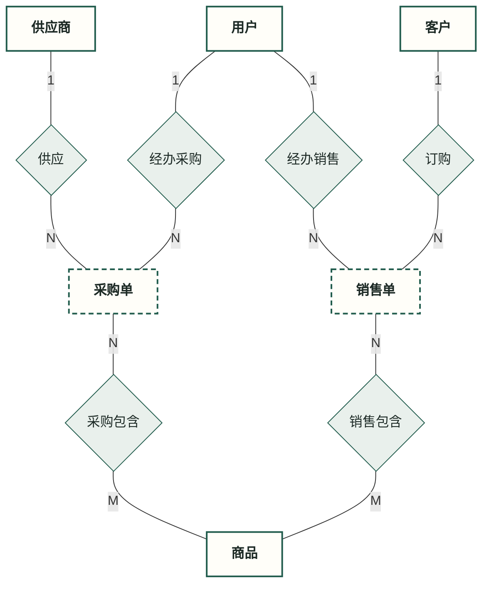
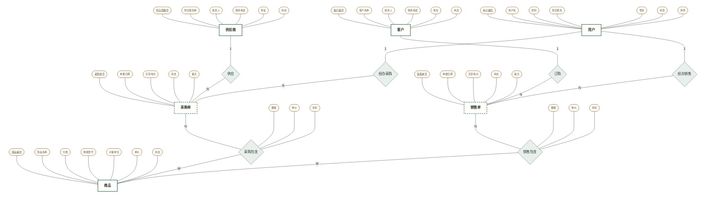
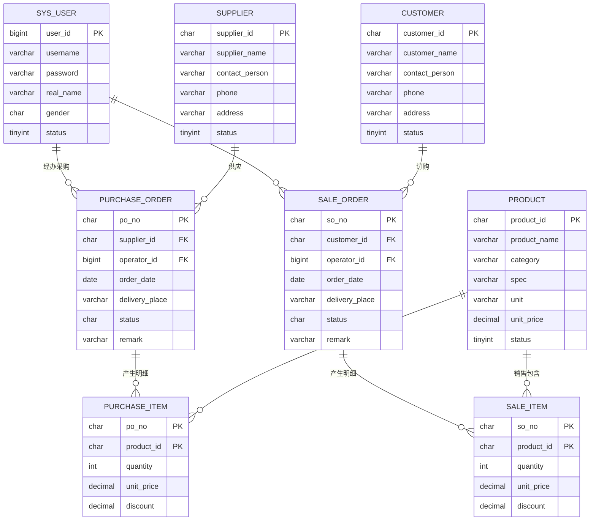

# 商品进销存管理系统 —— ER 图 Mermaid 代码

> 文档定位：本文是《01-ER模型设计.md》的配套**绘图代码集**，所有代码与该文档的实体、属性、联系、基数一一对应，复制到支持 Mermaid 的环境（GitHub/GitLab、VS Code Mermaid 插件、Typora、语雀、Mermaid Live Editor 等）即可直接渲染。
> 图与设计文档的对应：
> - **图一**：概念层结构主图（只看实体、菱形、基数）↔《01》第 4、6、8 章
> - **图二**：概念层陈式 ER 全图（矩形/虚线矩形/菱形/椭圆/主键下划线，全 42 属性）↔《01》第 5、6、8 章
> - **图三**：逻辑层 8 表关系图（字段 + PK/FK + 基数）↔《01》第 10.2、12 章 与《02-数据库设计.md》

---

## 图一：概念层 ER 结构主图（精简，不含属性）

用途：整体展示 6 个实体、6 个联系及 12 条边上的基数，适合放进报告的"总体结构"部分。采购单、销售单用**虚线边框**表示虚实体。

> 读图：供应商—1:供应:N—采购单；客户—1:订购:N—销售单；用户—1:经办:N—单据；采购单/销售单—N:包含:M—商品。

---

## 图二：概念层陈式 ER 全图（含全部 42 个属性）

用途：完整还原陈式 ER 图符号——**矩形=实体、虚线矩形=虚实体、菱形=联系、胶囊形（近似椭圆）=属性、主键属性带下划线**；数量/单价/折扣挂在"包含"菱形上。代码较长，一次渲染即为完整 ER 图。

元素核对（与《01》8.4 一致）：实体矩形 6（虚线 2）、联系菱形 6、实体—联系连线 12、实体属性 36、联系属性 6、椭圆合计 42、主键下划线 6。

> 说明：Mermaid 没有"纯椭圆"节点，这里用胶囊形 `([文字])` 近似陈式椭圆；虚实体用虚线矩形。数量/单价/折扣明确连在菱形上，单据实体上不出现任何外键属性。

---

## 图三：逻辑层 8 表关系图（全字段，erDiagram）

用途：概念图落为关系模型后的结果。8 张表、字段类型、PK/FK、外键基数一目了然；M:N 联系通过明细表 PURCHASE_ITEM / SALE_ITEM 实现。

基数读法（Crow's Foot）：`||` 表示"一且仅一"，`o{` 表示"零或多"。
- 一个供应商/客户/用户 对应 **0 或多张**单据；
- 一张单据 对应 **0 或多行**明细；一种商品可出现在 **0 或多行**明细中；
- PURCHASE_ITEM 以 `(po_no, product_id)` 为联合主键，分别外键指向 PURCHASE_ORDER、PRODUCT，从而实现"采购包含"的 M:N；SALE_ITEM 同理。
- 图中无金额/合计/库存数量字段：金额由 单价×数量×折扣 实时计算，库存由视图 v_stock 汇总（导出项不入库）。

---

## 使用与渲染注意事项

1. **主键下划线 `<u>`**：图二用 `<u>属性名</u>` 表示主键下划线，需 Mermaid **9.4+** 且在带引号标签中解析 HTML。若你的渲染器不显示下划线（显示成原文），可把 `<u>用户编号</u>` 改为 `用户编号 PK`，语义等价。
2. **在线微调布局**：可把代码贴到 Mermaid Live Editor（mermaid.live），导出 SVG/PNG 插入报告；图二节点较多，导出图片比截图清晰。
3. **若教师要求弱实体规范**：把图二的 PO/SO 改为双线矩形、R5/R6 改为双菱形即可（Mermaid 无原生双线符号，可在标签上加注或改用绘图工具描边），语义不变，详见《01》第 4 章注。
4. **视图不入图**：v_purchase_full、v_sale_full、v_stock 属实现层，不出现在以上任何 ER 图中。
